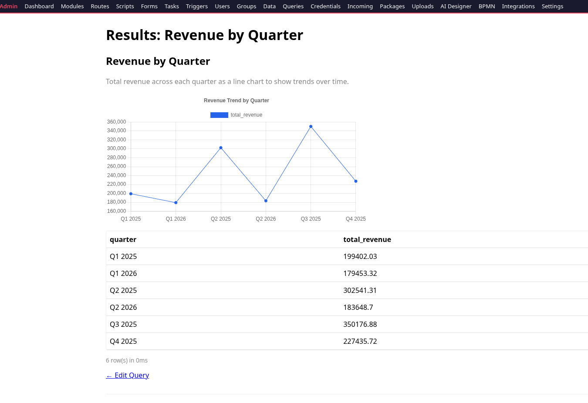

# PythonAppFoundry

This is a restart of a 15-year-old project to create an "embedded database" web app platform for Python and HTML. The intent is that all scripts, HTML, scheduled tasks, processes — everything — goes into a database, and the platform reads out what it needs on demand to run the application. Not a unique concept now, but 15+ years ago it was rather rare.

For the most part the database is fed by XML imports. The original plan was to create graphical designer tools that would export (and import for edits) XML to be sent to the DB to run. But this is 2026 — so instead of GUI design tools, LLMs are used to create and edit the XML for you. More GUI/code builder tools may come later.

## Security Improvements (v2.0)

- **Hardened script sandbox** — Scripts cannot import dangerous modules (`os`, `subprocess`, `sys`, `socket`, etc.)
- **Webhook rate limiting** — Webhooks are limited to 30 calls/minute and 600 calls/hour per slug
- **TLS certificate verification** — `call_api()` now verifies SSL certificates by default
- **Settings access control** — Scripts cannot read sensitive settings (passwords, API keys) via `get_setting()`
- **Input validation** — Slugs, routes, and cron expressions are validated before acceptance
- **XSS prevention** — Form preview editor now escapes user-controlled values

## Features

- **Module system** — Think of modules as applications. Each module is a self-contained bundle of routes, scripts, forms, scheduled tasks, triggers, and optional BPMN workflow data. Multiple modules run side-by-side, each with their own URL endpoints.
- **AI Module Generation** — An embedded chat interface (AI Designer) generates complete modules from natural language prompts. The actual LLM is external via API calls — supports llama.cpp and OpenAI endpoints. Your results will vary greatly depending on how good your LLM is at both coding and following directions.
- **BPMN Workflow Designer** — A visual drag-and-drop process designer (powered by bpmn-js) for more complex workflows. You still describe your intent and data needs, but the structured diagram makes it easier to manage modules with moving parts. Convert diagrams to runnable modules with one click.
- **Dynamic Tables** — Scripts create and query database tables on the fly via `DynamicModel.get_or_create()` — no migrations, no schema changes.
- **Sandboxed Script Runner** — Python scripts execute in a restricted environment with safe builtins and documented helpers (`send_email`, `render_form`, etc.).
- **Role-Based Access** — Three roles: **Admin** (full system control), **Developer** (create/manage modules, routes, scripts, forms — can't manage users or settings), and **User** (can log in to auth-protected routes only).
- **Full Admin Panel** — CRUD for modules, routes, scripts, forms, tasks, triggers, users, groups, data tables, settings, and file uploads. All list views include column sorting, module filtering, and CSV export.
- **Bundle Import/Export** — Modules export as XML for backup or transfer between instances. Import XML to create or update modules.
- **SMTP Email** — Platform-wide SMTP settings; `send_email()` is available in all scripts.
- **Chart.js Charts** — Saved SQL queries render results as bar, line, pie, doughnut, polar area, or radar charts using Chart.js (vendored, no CDN). Module scripts can also draw charts via the `render_chart()` helper.
- **AI-Assisted SQL Builder** — Create queries via natural language (powered by the same LLM backend) or a visual drag-and-drop builder at `/__admin/queries/builder`. Existing queries can be enhanced with "Enhance with AI Builder" from the edit form, refining SQL without losing chart/schedule settings.
- **Scheduled Query Reports** — Queries with a cron schedule and email recipient run automatically; results emailed as CSV.
- **CSV Export** — Every list view and data table supports CSV download.
- **Module Versioning** — Automatic version snapshots on every import (AI Designer, BPMN) and manual version creation. Rollback to any previous state with one click, diff between versions, and add comments to track changes over time.
- **Module Dependency Tracking** — Automatically detects when modules reference other modules' routes or scripts. Shows dependency warnings before deletion to prevent silent breakage. Manual "Scan" button to re-detect dependencies.
- **System Dashboard** — Health overview at `/__admin/dashboard` showing module/route/script counts, system info (Python/Flask versions, uptime), recent execution logs with View Error/Output buttons for full details, database table sizes, and per-module summaries. All script executions are automatically logged.
- **Webhook Support** — External services can trigger scripts via HTTP POST to `/__api/webhook/{slug}`. Configure webhooks as triggers with `event_type='webhook'`. Scripts receive the payload data for processing.
- **Group-Based Route Access** — Restrict routes to specific user groups. Users must be logged in and belong to at least one allowed group to access the route.
- **AI-Powered Script Debugging** — When a script fails, click "Ask AI about this error" on the dashboard, debug page, or test modal. The error and script source are sent to the configured LLM for root cause analysis and a corrected script. On the script editor, "Apply Fix" auto-populates the source code textarea.
- **Audit Log** — Tracks all administrative actions (module CRUD, user management, settings changes, imports, deletions) with user, timestamp, entity, and IP address. Filterable list view at `/__admin/audit`.
- **Database Templates** — Jinja2 templates stored in the DB, rendered via `render_db_template()` in a sandboxed environment. Reusable HTML fragments, email bodies, and JSON responses managed alongside scripts and forms. Edit page includes live preview with sample context.
- **Async Script Execution** — Webhooks accept `?async=true` to run scripts in a background thread pool (returns 202 immediately with execution ID). Status polling via `/__api/execution/<id>`. Scheduled tasks also use the async executor. Configurable worker count in Settings.
- **Script Debug Mode** — Run scripts directly from the editor with "Run Debug" to see source code, line numbers, output, and execution timing.
- **Encrypted Credential Store** — API keys, tokens, and passwords stored encrypted at rest (Fernet), module-scoped, accessible in scripts via `get_credential('name')`.
- **Built-in HTTP Client** — `call_api()` in scripts handles retries, timeouts, JSON parsing, and consistent error returns — no extra dependencies needed.
- **Integration Health Dashboard** — Error rate, average latency, and execution log viewer per module at `/__admin/integration-health`.
- **Incoming Email (IMAP Polling)** — Platform-level IMAP poller stores emails in `incoming_emails` table; modules claim and process them via SQL.
- **Package Management** — Install, list, and uninstall Python packages from `/__admin/packages`. Module XML can declare `<requirements>` for auto-install on import. No server restart needed.
- **Module Cloning** — One-click duplicate of any module from the admin list to use as a starting point.
- **Cron Validation** — Invalid cron expressions are caught on save, preventing silent task failures.
- **Log Retention** — Auto-cleanup of old execution logs configurable from Settings.
- **Email Test Button** — Verify SMTP configuration with a single click from the Settings page.
- **Database Backup/Restore** — Create, download, and restore database backups from `/__admin/backups`. Emergency backups are created automatically before restores.
- **Script Execution History** — View recent executions per module at `/__admin/modules/<id>/executions`.
- **Test Script Button** — Inline script testing with AJAX-powered modal output at the script editor.
- **XML Import Preview** — Preview what will be imported before committing (counts of scripts, routes, forms, tasks, triggers).
- **Multi-Tenant Support** — Basic tenant isolation via subdomain or path prefix (extensible).
- **OpenAPI/Swagger Spec** — Auto-generated OpenAPI 3.0 spec at `/__api/openapi.json` with Swagger UI at `/__api/swagger`.
- **Module Marketplace** — Share and discover modules via `/__admin/marketplace`. Publish modules with `publish_module()`.
- **Structured Logging** — JSON-formatted logs with context (module_id, script_id, user_id) via `setup_structured_logging()`.
- **Webhook Retry/Dead Letter** — Failed webhooks are retried up to 3 times with exponential backoff. Failures go to a dead letter queue.
- **Python Syntax Highlighting** — Script editor now has basic keyword/string/comment highlighting via `python-highlight.js`.
- **Health Check Enhancement** — `/healthz` now verifies database connectivity, scheduler status, and IMAP configuration.
- **Configuration Validation** — Warnings for insecure defaults (SECRET_KEY, DATABASE_URL) at startup.
- **Database Migration** — Migrate between SQLite and PostgreSQL directly from the admin UI at `/__admin/db-migration`. Includes automatic backup, data verification, and audit logging. Requires `psycopg2-binary` for PostgreSQL targets.
- **Global Search** — Instantly find any entity across the platform at `/__admin/search`. Search modules, routes, scripts, forms, users, groups, tasks, triggers, and settings by name, slug, or description.
- **Dynamic Table Indexing** — Improve query performance for dynamic tables at `/__admin/indexes`. Add indexes to frequently filtered columns via admin UI or `DynamicModel.get_or_create()` with `indexes` parameter.
- **Vendored Swagger UI** — OpenAPI/Swagger documentation at `/__api/swagger` uses locally hosted assets (no CDN dependency). Enables air-gapped deployments.
- **Enhanced Health Checks** — `/healthz` endpoint now checks async executor, dead letter queue, credential store, and filesystem. Admin dashboard at `/__admin/health` provides detailed system monitoring.

### Demo Modules

Import demo modules to explore the platform:

**Jinja2 Template Demos** (use `render_db_template()` with stored templates):
- `demos/recipe_book.xml` — Recipe grid with search, detail pages, cuisine filters. Demonstrates list/detail templates with loops, conditionals, and filters.
- `demos/task_board.xml` — Kanban board with columns, priority badges, overdue detection. Demonstrates grouped data rendering and dark theme templates.
- `demos/bookshelf.xml` — Book spine shelf with hover modals, ratings, status filters. Demonstrates creative CSS layouts and interactive templates.

**Legacy Demos** (use inline `render()` or string concatenation):
- `demos/guestbook.xml` — Forms, DynamicModel data collection, rendered output at site root
- `demos/pixel_art_gallery.xml` — Visual showcase of retro pixel art with styled grid layout
- `demos/cat_fact_finder.xml` — Scheduled email delivery, webhook triggers, group-based route access
- `demos/incoming_mail_demo.xml` — IMAP email processing with automated claiming and notification
- `demos/api_integration_demo.xml` — Interactive API test page demonstrating `get_credential()` and `call_api()`
- `demos/admin_tools.xml` — Admin utility demonstrations
- `demos/sales_demo.xml` — Sales tracking with query reports and charts

## Quick Start

### Option 1: Direct Installation

```bash
git clone https://github.com/Nurb4000/PythonAppFoundry && cd PythonAppFoundry
pip install -r requirements.txt
cp .env.example .env 2>/dev/null || touch .env   # defaults work for SQLite
python3 run.py
```

Visit `http://localhost:5000/` — you'll be redirected to the Setup page to create the initial admin account.

### Option 2: Docker Deployment (Recommended for Production)

**Prerequisites:** Docker and Docker Compose installed.

1. **Clone and configure:**
   ```bash
   git clone https://github.com/Nurb4000/PythonAppFoundry && cd PythonAppFoundry
   cp .env.docker.example .env
   # Edit .env with your settings (especially SECRET_KEY!)
   ```

2. **Start with SQLite (default):**
   ```bash
   docker compose up -d
   ```

3. **Start with PostgreSQL (production):**
   ```bash
   cp docker-compose.prod.yml.example docker-compose.prod.yml
   # Edit docker-compose.prod.yml with your secrets
   docker compose -f docker-compose.yml -f docker-compose.prod.yml up -d
   ```

4. **View logs:**
   ```bash
   docker compose logs -f web
   ```

5. **Access the application:**
   - Web UI: `http://localhost:5000/`
   - Health check: `http://localhost:5000/healthz`
   - OpenAPI spec: `http://localhost:5000/__api/openapi.json`

**Docker Compose services:**
- `web` — The PythonAppFoundry application
- `db` — PostgreSQL database (optional, replaces SQLite)
- `llamacpp` — llama.cpp server for AI module generation (optional)

**Volumes:**
- `./instance` — Application data (database, uploads, backups, credentials)
- `./marketplace` — Module marketplace entries
- `postgres_data` — PostgreSQL data (named volume)

**Environment variables:** See `.env.docker.example` for all configuration options.

## Requirements

- Python 3.10+
- SQLite (default) or PostgreSQL (via SQLAlchemy)
- Docker and Docker Compose (optional, for containerized deployment)

It starts with SQLite for development, but uses SQLAlchemy so you can expand to larger database engines if needed.

For Docker deployment instructions, see [DOCKER_DEPLOYMENT.md](DOCKER_DEPLOYMENT.md).

## Configuration

| Setting | Location | Description |
|---------|----------|-------------|
| `SECRET_KEY`, `DATABASE_URL` | `.env` | Flask secret key and database connection |
| LLM provider, endpoint, API key, model | Admin → Settings | AI provider (llama.cpp or OpenAI), configured via GUI |
| SMTP host, port, credentials | Admin → Settings | Email sending for scripts |
| Registration controls | Admin → Settings | Disable registration, require admin approval |

## Guides

Three guides are included in the repo:

- **`ADMIN_AND_DEVELOPER_GUIDE.md`** — Getting started with the system: first run, admin bar, workflow instructions, LLM/AI configuration, SMTP setup. Covers both admin and module developer tasks.
- **`CONTRIBUTOR_GUIDE.md`** — Platform internals for developers contributing to the codebase: architecture, directory layout, models, services, security model, and development workflow.
- **`AI_GUIDE.md`** — A guide for the LLM itself. It explains the structure of the platform, the XML bundle format, available helpers and builtins, and how to generate proper code. This is very much a moving target — as we all know how stubborn LLMs can be.

## Architecture

```
run.py → create_app() (Flask factory)
  ├── app/routes/auth.py     — Setup, login/logout, registration
  ├── app/routes/admin.py    — Admin CRUD for all entity types
  ├── app/routes/dynamic.py  — Catch-all route handler (serves user modules)
  ├── app/routes/chat.py     — AI Designer chat sessions
  ├── app/routes/bpmn.py     — BPMN visual designer
  └── app/routes/api.py      — REST API (export, import, list modules, webhooks, OpenAPI spec)
  ├── app/services/script_runner.py  — Sandboxed Python execution (hardened import blocking)
  ├── app/services/ai_assistant.py   — LLM integration
  ├── app/services/bundle.py         — Module XML import/export
  ├── app/services/scheduler.py      — APScheduler cron task runner
  ├── app/services/triggers.py       — Event and webhook trigger firing (with retry/dead-letter)
  ├── app/services/versioning.py     — Module version snapshots, rollback, diff
  ├── app/services/dependencies.py   — Cross-module dependency detection
  ├── app/services/file_upload.py    — Secure file upload handling
  ├── app/services/credential_store.py — Fernet-encrypted credential storage
  ├── app/services/csrf.py           — CSRF token generation and validation
  ├── app/services/rate_limiter.py   — In-memory rate limiting (auth + webhooks)
  ├── app/services/validation.py     — Input validation (slugs, routes, cron, email)
  ├── app/services/admin_utils.py    — Shared admin patterns (decorators, proxies, exports)
  ├── app/services/backup.py         — Database backup/restore utilities
  ├── app/services/marketplace.py    — Module marketplace (publish/discover)
  ├── app/services/openapi.py        — OpenAPI 3.0 spec generation
  ├── app/services/structured_logging.py — JSON-formatted structured logging
  └── app/services/tenant.py         — Multi-tenant isolation support

See `ADMIN_AND_DEVELOPER_GUIDE.md#docker-deployment` for full Docker instructions.

### Key design decisions

- **Everything in the database** — Routes, scripts, forms, tasks, triggers all live in DB tables, not on the filesystem. The dynamic route handler catches undefined slugs and looks them up at runtime.
- **Scripts are auto-wrapped** — `return` works at the top level of any script. The `_result` variable provides a fallback.
- **Dynamic tables are flat** — No foreign key relationships. Scripts use explicit queries and joins.
- **Module → table lifecycle is decoupled** — Deleting a module doesn't automatically drop its DynamicModel tables (opt-in via checkbox).
- **AI settings in the DB** — All LLM and SMTP configuration is managed through the admin GUI, not environment variables.
- **Hardened script sandbox** — Scripts cannot import dangerous modules (`os`, `subprocess`, `sys`, `socket`, etc.). A custom `__import__` function blocks access at runtime.
- **Webhook reliability** — Webhooks retry up to 3 times with exponential backoff. Failed executions go to a dead letter queue for later review.
- **Rate limiting** — Auth endpoints and webhooks are rate limited to prevent abuse.
- **Multi-tenant aware** — Basic tenant isolation via subdomain or path prefix, extensible via the tenant service.
- **Structured logging** — JSON-formatted logs with context (module_id, script_id, user_id) for better monitoring.

## Models

| Model | Purpose |
|-------|---------|
| User | Authentication, roles (admin/developer/user), group membership |
| Group | Role-based user groups for access control |
| Module | Container bundling routes, scripts, forms, tasks, triggers; stores BPMN source data |
| Route | URL slug → script + form mapping with method and auth constraints |
| Script | Python source code executed by routes, tasks, or triggers |
| Form | JSON schema defining form fields rendered by `render_form()` |
| ScheduledTask | Cron-triggered script execution via APScheduler |
| Trigger | Event-based hooks (on_insert, after_route, webhook) |
| DynamicModel | Factory that creates/retrieves SQLAlchemy table models at runtime |
| Setting | Key-value store for platform configuration |
| Upload | File upload metadata |
| ChatSession / ChatMessage | AI Designer conversation history |

## Scripting

Scripts have these variables available without imports:

```
request, session, db, current_user
redirect, url_for, flash, render, jsonify
send_email(to, subject, body, html=False)
render_form(action, method, submit_label, fields=form_fields)
form_fields                    # list of parsed field dicts (when route has a form)
DynamicModel                  # factory for dynamic database tables
datetime, timezone            # from datetime module
```

Builtins available: `int`, `str`, `list`, `dict`, `len`, `range`, `enumerate`, `zip`, `sorted`, `min`, `max`, `sum`, `any`, `all`, `isinstance`, `type`, `hasattr`, `getattr`, `setattr`, `dir`, `print`, common exception types. The sandbox deliberately excludes `os`, `subprocess`, `eval`, and `open` to prevent system access. Imports work normally (`import` / `from ... import`).

## Dependencies

- Flask 3.0, Flask-SQLAlchemy, Flask-Login, Flask-Migrate
- bcrypt, APScheduler, python-slugify, python-dotenv
- cryptography (for encrypted credential store)

### Optional Dependencies

- **PostgreSQL** — Use `psycopg2-binary` for production deployments (`pip install psycopg2-binary`)
- **llama.cpp** — For local AI module generation (see Docker deployment)
- **OpenAI API** — For cloud-based AI module generation (configured in Admin → Settings)

## License

MIT — see [LICENSE](LICENSE).

Copyright 2026 IDS


## Screenshots





